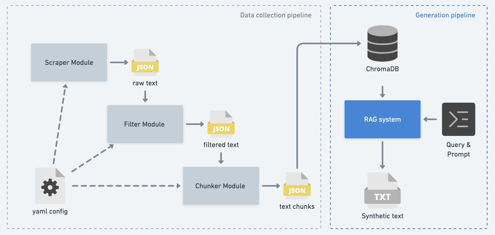

# Text Generation Agent

This project is a modular **text generation agent** that can create enriched **synthetic data** on a chosen topic. It is designed to work fully locally, therefore uses a lightweight quantized LLM (Mistral-7B), and embedding model (all-MiniLM-L6-v2). It's recommended to have 16GB of CPU memory, although LLM inference can easily be swapped for API calls to 3rd party models if needed. 

The project has 2 main components:  

1. **Data Collection Pipeline**  
   - Scrapes text data (currently from Reddit).  
   - Cleans & filters the collected text with **semantic filtering**.  
   - Chunks the cleaned text for downstream usage.  

2. **Generation Pipeline**  
   - Uses a **Retrieval-Augmented Generation (RAG)** system to retrieve relevant chunks from the database.
   - Generates enriched synthetic responses in a customized format. 
     - Current text generation module demonstates this with a Q&A style format. 


A demo of the project can be found under `notebooks/demo.ipynb`. 

### High level Workflow: 


<div align="center">
  
</div>


---

## 📂 Project Structure

```
.
├── .env                 # Virtual Environment 
├── api/                 # API layer (entrypoints for serving)
├── configs/             # Configuration files
├── data/                # Data storage
│   ├── raw/             # Raw scraped data
│   ├── filtered/        # After filtering
│   └── chunks/          # After chunking
├── models/              # Model-related assets
│   ├── embedding/       # Embedding models
│   └── genLLM/          # Generation LLM models
├── notebooks/           # Demo / experiment notebooks
├── src/                 
│   ├── kb_builder/      # Cleaning & Filtering 
│   ├── RAG/             # Customized text generation 
│   ├── scrapers/        # Web scraping (reddit)
│   ├── scripts/         # Execution scripts
│   └── utils/           # Data handling & helper functions 
```
---

## 📝 Config file 

Most of the Data collection parameters are stored and managed from a single file in `configs/config.yaml`.

**Config example:**

```yaml
paths: 
  data_dir: data/                   # Base directory for storing all project data
  raw_data_dir: ../data/raw/        # Directory for raw scraped data
  filtered_data_dir: data/filtered/ # Directory for semantically filtered data
  chunk_data_dir: data/chunks/      # Directory for chunked data
  model_dir: models/                # Directory for embeddings and LLM models

reddit_scraper:
  credentials:
    client_id:                     # Reddit API client ID
    client_secret:                 # Reddit API client secret
    user_agent:                    # Reddit API user agent string

  search:
    subreddits:                      # Target subreddits to scrape from
      - changemyview
      - AskReddit
      - PoliticalDiscussion
    queries:                         # Search queries/topics
      - "diversity equity inclusion"
      - "DEI"
      - "inclusion AND leadership"
      
    sort: top                    # Sort order for Reddit search (top, new, hot)
    time_filter: all             # Time window for search (all, year, month, etc.)
    limit: 20                    # Max number of posts to scrape
    rate_limit_delay: 0.1        # Delay between requests (in seconds) to respect rate limits

    filters:                     
      n_comments: 20             # Number of comments comments to extract per post 
      min_post_score: 20         # Minimum upvotes required for a post
      min_comment_score: 10      # Minimum upvotes required for a comment
      min_char_length: 100       # Minimum character length for a text to be considered

semantic_filter: 
  topic: DEI                     # Chosen topic for semantic filtering
  n_keywords: 5                  # Number of keywords to extract (text & topic)
  similarity_threshold: 0.4      # Cosine similarity threshold for relevance filtering
  min_token_len: 70              # Minimum token length for filtered text
```

---

## 🚀 How It Works

### 1. Scraping

**Reddit scraper** (`src/scrapers/reddit_scraper.py`)

Relevant posts and comments are collected using Reddit's official API. The scraper can be configured (`config.yaml`) to search specific subreddits and queries, with optional filtering applied (upvotes, n_comments, etc).
See for: [Reddit API credentials](https://www.jcchouinard.com/reddit-api/).

Each raw entry can be stored in a JSONL file (`data/raw/*.jsonl`).


### 2. Filtering 

**Semantic Filter** (`src/kb_builder/semantic_filter.py`)

Irrelevant content is removed by: 

- **Keyword generation**:
  - N Keywords are generated using the gen LLM (`Mistral-7B`) based on the chose Topic (in config).
    - *Example: "climate change" -> ["climate change", "environment", "carbon", "temperature", "pollution"]*
  - N Keywords which summarize each raw data entry are extracted using `all-MiniLM-L6-v2` + `KeyBERT`. 
- **Vector similarity**: We calculate (min-max normalized) sentence-wise cosine similarity scores between topic keywords and text keywords, to determine semantic relevance of of each text to the **core topic**.
- **Threshold filtering**: We define a similarity threshold and keep posts above the cutoff
  - *Recommended between 0.2 and 0.4*

Each filtered entry can be stored in a JSONL file (`data/filtered/*.jsonl`)

### 3. Chunking

- We use the **chunker**  to break down large texts into more manageable and semantically coherent chunks.  
- Each chunk can be stored in a JSONL file (`data/chunks/*.jsonl`).

**NOTE**: *Currenlty the chunker only passes filtered entries directly as chunks. A more sophisticated semantic chunker could improve results.*

### 4. Retrieval-Augmented Generation (RAG)

The retriever (`RAG/retriever.py`) loads the JSONL entries into a chromaDB collection. It uses query based retrieval using `all-MiniLM-L6-v2` embeddings and returns the top_k most relevant texts from the knowledge base, as is common with RAG pipelines. 


The generator (`RAG/QA_generator.py`) uses the retrieved texts to generate responses. The output could be structured in different formats, in this project, this generator is designed to return semantically inspired responses to a specific question on the given topic in a Q&A format. 

---

## ⚙️ Installation

```bash
# Clone the repository
git clone https://github.com/your-username/text-generation-agent.git
cd text-generation-agent

# Create and activate environment
python -m venv venv
source venv/bin/activate   # On Windows: venv\Scripts\activate

# Install dependencies
pip install -r requirements.txt
```

---

## 🔧 Improvements!

- [ ] Configure GPU backend option for better LLM inference
- [ ] Implement a more sophisticated chunking method (eg. hierarchical + semantic)
- [ ] Add RAG Response styling options 
- [ ] Add structured output parsing for generated responses
- [ ] Add RESTful API endpoints for external service integration
- [ ] Support for additional data sources beyond Reddit


